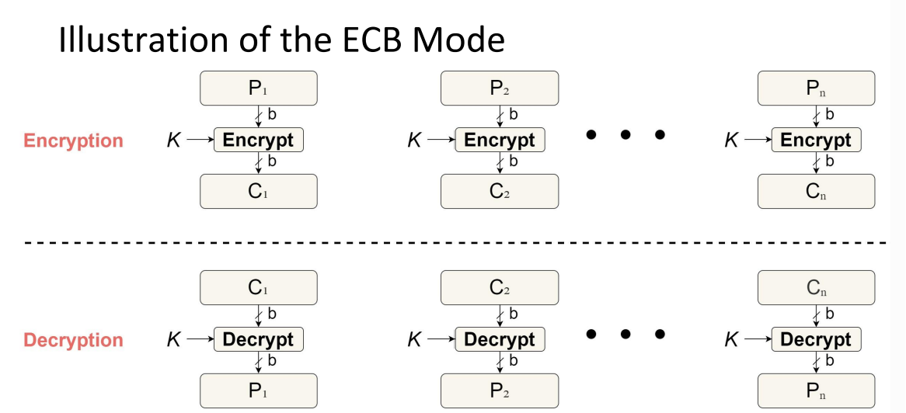
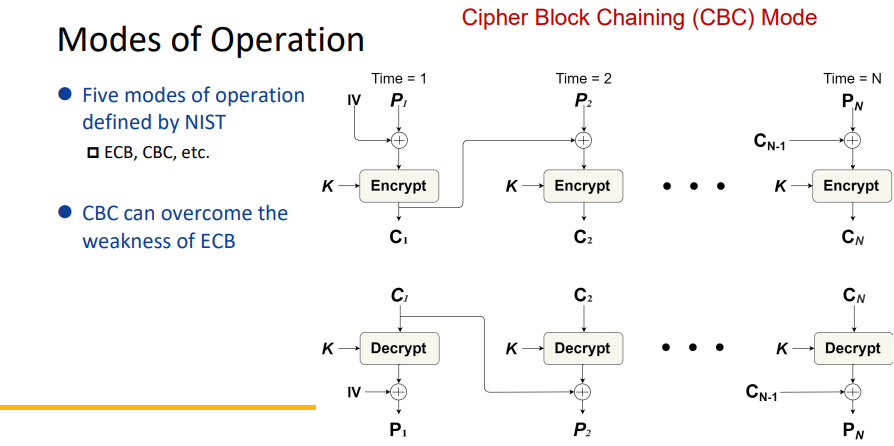

Cryptographic Tools
===
🔙 [MENU README](../README.md)

# Confidentiality with Symmetric Encryption
1. Symmetric encryption
   - Providing confidentiality for transmitted or stored data
   - Conventional encryption or single-key encryption
2. Two requirements for its secure use
   - A strong encryption algorithm
   - Opponent: **Unable to decrypt ciphertext or discover the key**, (given pairs of ciphertexts and plaintexts, as well as the algorithm)
   - Secure **key distribution and maintenance**

3. Model of Symmetric Encryption
   
   > Encryption algorithm (DES、AES)

4. Attacking Symmetric Encryption
   - **Cryptanalytic Attacks**
   - Brute-Force Attacks

   

5. Data Encryption Standard (DES)
   - Adopted in 1977 by the NIST (FIPS PUB 46)
     - Most widely used encryption scheme: aka Data Encryption Algorithm (DEA)
     - **64-bit plaintext blocks and a 56-bit key ➔ 64-bit ciphertext blocks**
   - Security concerns
     - Most-studied encryption algo: numerous attempts to find weakness, but **no fatal one yet**
     - **Key length: too short** 56 bits,2^56 possible keys (Inadequate for today’s processor speed)
     - **Encryption operations are relatively slow.**

6. Brute-Force Attacks against DES
   - On average, half the key space has to be searched
       One DES encryption per micro second ➔ more than 1000 years (3.6 x 10^16 keys)
   - In July 1998, EFF broke a DES encryption
       DES cracker: less than $250,000, less than three days
   - Encryption speeds advance
      Contemporary supercomputer (2012): 10^13 per second ➔ break DES within 1 hour

7. Triple DES (3DES)
   - Part of the DES in 1999: FIPS PUB 46-3
     - **Repeat basic DES algorithm 3 times** using either 2 or 3 unique keys
     - **A key size of 112 or 168 bits**
   - Two attractions
     - 168-bit key length: overcomes brute-force attack of DES
     - **Underlying encryption algorithm is the same as in DES**
   - Two drawbacks
     - **Sluggish** algorithm/software: **not efficient software code and three times as DES**
     - **Uses a 64-bit block size: not efficient and not secure**

8. Advanced Encryption Standard (AES)
   - AES: now widely available in commercial products
     - A replacement for 3DES
     - 3DES was not reasonable for long term use
   - NIST called for proposals for a new AES in 1997
     - Security strength: **equal to or better than 3DES**
     - Significantly improved efficiency
     - **Symmetric block cipher**
     - 128-bit data and **128/192/256 bit keys**
   - Selected **Rijndael Algorithm** in Nov. 2001: published as FIPS 197

9. Symmetric Block Encryption Algorithms
   

   

10. Block Cipher - Practical Security Issues
    - How to apply the symmetric encryption to a unit of data larger than a single 64-bit or 128-bit block?
      e.g., E-mail messages, network packets, and database records
    - **Simplest approach: electronic codebook (ECB)**
      - Multiple block encryption
      - **Each block of plaintext is encrypted using the same key**
    - Issue: Cryptanalysts may exploit **regularities** in the plaintext

      

      

> 56:25
---

# Message Authentication and Hash Function
---
# Public-Key Encryption
---
# Digital Signatures and Key Management
---
# Random and Pseudorandom Numbers
---